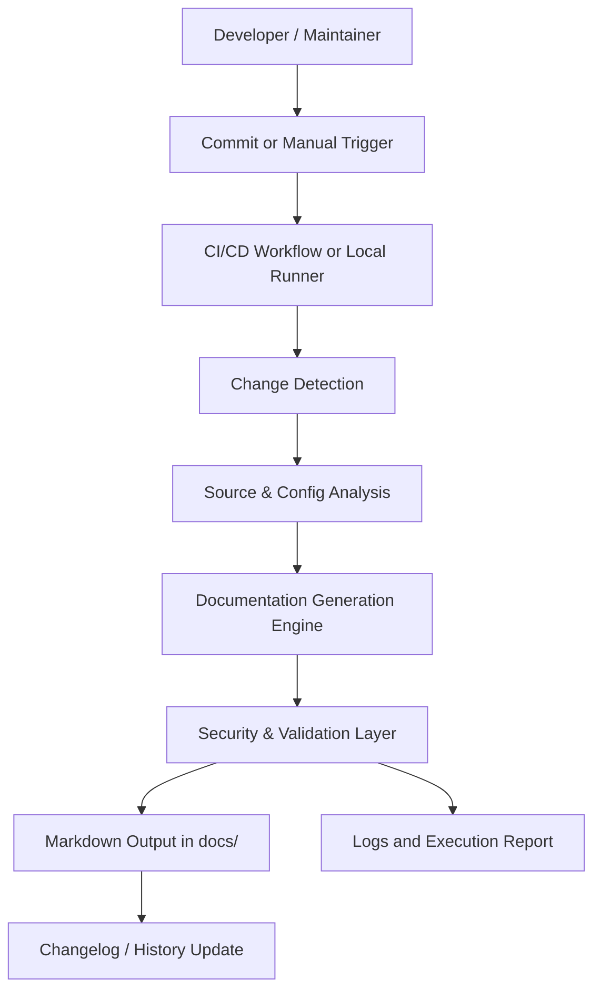

# Architecture: Automated Documentation Sync

## 1. Architecture Overview
The Automated Documentation Sync feature will add a lightweight documentation pipeline to the existing Spring PetClinic repository. The solution will reuse the current Spring Boot project structure, build tooling, and repository workflow instead of introducing a separate platform or heavy infrastructure.

The architecture consists of:
- a trigger mechanism for detecting relevant changes,
- a documentation generation workflow,
- a content analysis layer that inspects the application source and configuration,
- a Markdown generation layer that writes output into the project's docs folder,
- a validation and security layer that prevents sensitive data from being published,
- and a logging/reporting mechanism for execution visibility.

This design keeps the feature practical for an internal engineering team while remaining aligned with the repository's current maturity and build conventions.

## 2. Architecture Goals
The architecture is designed to achieve the following goals:
- Reuse the existing Spring Boot project and repository conventions where possible.
- Keep the solution low-complexity and maintainable.
- Support both automated CI/CD execution and manual local execution.
- Generate comprehensive internal documentation in Markdown format.
- Keep documentation synchronized with source changes and configuration updates.
- Prevent secrets or sensitive values from appearing in generated output.
- Provide clear failure handling and traceability for maintainers.

## 3. Assumptions
- The target system is the existing Spring PetClinic repository.
- The project will continue to use Java, Spring Boot, and either Maven or Gradle for build operations.
- Documentation is intended for internal project use, not public publishing.
- The repository can include a docs folder for generated artifacts.
- The documentation process can be triggered by repository events and manual execution.
- Source inspection can rely on repository files, application structure, and existing conventions rather than a fully dynamic runtime introspection approach.

## 4. High-Level Architecture Diagram (Mermaid)

## 5. Key Components and Responsibilities
### 5.1 Trigger Layer
Responsible for starting the documentation workflow.
- Detects relevant repository changes such as REST controller updates, configuration changes, or other supporting source modifications.
- Supports CI/CD invocation after commits and manual invocation for local troubleshooting.

### 5.2 Orchestration Layer
Responsible for coordinating the documentation run.
- Invokes the analysis and generation steps in a defined sequence.
- Handles success, failure, and retry behavior where appropriate.
- Ensures that documentation generation is treated as an atomic operation.

### 5.3 Source and Configuration Analysis Layer
Responsible for collecting information from the repository.
- Inspects Spring MVC controller classes and endpoint mappings to identify REST endpoints, HTTP methods, paths, and controller-level descriptions.
- Reads application properties and profile-specific configuration files to capture environment configuration details and default settings.
- Collects build and run instructions from repository documentation and project metadata.
- Identifies relevant files that influence the generated documentation and limits analysis to those files when possible.
- Uses a lightweight extraction strategy based on repository inspection rather than runtime instrumentation, with explicit fallbacks for unsupported or ambiguous cases.

### 5.4 Documentation Generation Layer
Responsible for turning discovered information into Markdown output.
- Produces sections such as API reference, endpoint descriptions, request/response details, setup instructions, configuration details, build instructions, and changelog information.
- Uses a content mapping strategy where each documentation section is populated from a specific source: endpoint metadata from controllers, setup and build instructions from repository docs and build files, configuration details from properties files, and changelog information from a generated history entry.
- Writes output into the docs folder and updates existing files in place using a canonical documentation update strategy.

### 5.5 Security and Validation Layer
Responsible for ensuring generated content is safe and usable.
- Applies secret detection rules to identify values matching common secret patterns such as passwords, access tokens, API keys, private keys, and embedded connection strings.
- Redacts or removes sensitive values before writing output.
- Sanitizes generated Markdown to prevent accidental leakage of environment-specific or credential-like content.
- Validates that generated content does not include secrets, malformed content, or incomplete sections before publication.
- Prevents partial output from being treated as a successful publication.

### 5.6 Logging and Reporting Layer
Responsible for operational transparency.
- Records timestamps, trigger source, affected files, output location, execution status, and summary counts in structured logs.
- Captures errors and warnings in a structured and readable way.
- Supports troubleshooting and auditability through a standard log schema and run summary artifact.
- Provides notifications for failed or successful runs through CI output and optional workflow notifications.

## 6. Data Flow
1. A repository change or manual action triggers the documentation workflow.
2. The orchestration layer identifies relevant files and determines whether documentation should be regenerated using incremental change detection.
3. The analysis layer reads only the relevant source files, configuration files, and repository metadata needed for the affected documentation sections.
4. The generation layer transforms the collected information into Markdown sections using a defined content mapping strategy.
5. The security and validation layer checks the generated content for sensitive data, completeness, and structural issues.
6. The validated documentation is written to the docs folder through atomic file operations and a temporary staging area.
7. The changelog/history content is updated with the latest run details without duplicating previous documentation content.
8. Logs and status information are recorded for maintainers and CI/CD visibility, including success/failure outcome and summary details.

## 7. Technology Stack
- Language: Java with Spring Boot
- Build Tooling: Maven or Gradle, consistent with the existing project
- CI/CD: GitHub Actions or equivalent workflow runner
- Documentation Format: Markdown
- Output Location: docs folder in the repository root
- Scripting/Automation: Shell or Python-based helper scripts, or equivalent lightweight automation logic
- Logging: Standard workflow logs and optional structured log files
- Security: Content sanitization and redaction rules before documentation publication

## 8. Sequence of Execution
1. A commit is pushed or a maintainer manually starts the workflow.
2. The workflow checks out the repository and prepares the working environment.
3. The trigger logic identifies whether relevant files changed and whether a full or incremental documentation run is required.
4. The analysis layer collects project metadata, configuration details, and relevant endpoint information from the affected files and supporting project files.
5. The generation engine creates or updates Markdown documentation in a temporary staging area.
6. The validation layer checks output quality and security compliance.
7. If validation succeeds, the staged documentation is published to the canonical docs folder and the run is marked successful.
8. If validation fails, the run is marked failed, relevant errors are logged, the staging output is discarded, and the previous known good documentation remains intact.

## 9. Design Decisions
- Reuse the existing Spring Boot repository rather than introducing a separate documentation service.
- Keep the solution repository-native and workflow-driven for low operational cost.
- Generate Markdown directly instead of introducing a separate documentation platform.
- Favor static analysis and repository-based introspection over runtime instrumentation to reduce complexity.
- Keep the generation process deterministic so that the same source state produces the same documentation output.
- Preserve the last known good documentation when a generation run fails.
- Use an incremental generation model that only reprocesses documentation sections impacted by changed files.
- Define a canonical documentation update strategy so that only one set of generated files is maintained in the docs folder.

## 9.1 Documentation Extraction Strategy
- REST endpoints will be extracted by inspecting controller classes and their mapped request paths, methods, and relevant annotations.
- Endpoint descriptions will be derived from controller-level comments, method-level comments, and available naming conventions where explicit descriptions are not present.
- Request and response details will be represented at a summary level unless richer metadata is available from the codebase.
- Setup instructions, build commands, environment configuration details, and changelog content will be sourced from repository documentation, build files, properties files, and generated history entries.

## 9.2 Generator Component Boundaries
- Trigger and workflow orchestration manage execution start and stop conditions.
- Source analysis collects repository metadata and extracts documentation-relevant facts.
- Content mapping transforms extracted facts into structured documentation sections.
- Markdown rendering produces the final output files.
- Validation and security guard against sensitive content and incomplete output.
- Publishing handles file writes, rollback, and final output placement.

## 9.3 Error Handling Model
- The generator will classify errors into categories such as configuration errors, parsing errors, security validation errors, file write errors, and unexpected runtime errors.
- Configuration and parsing errors will fail the run and prevent publication of new output.
- Security validation errors will fail the run and block publication until the issue is resolved.
- File write errors will trigger rollback to the previous known good documentation state.
- Non-critical warnings may be logged without failing the run when the documentation remains usable.

## 9.4 Logging, Monitoring, and Notification Strategy
- Each run will emit structured logs including run ID, trigger source, timestamp, affected files, output location, status, and error category.
- CI logs will remain the primary operational channel, with an optional summary artifact written to the docs folder or workflow artifact storage.
- Failed runs will produce a clear error summary for maintainers.
- Successful runs will record a summary of generated sections and updated files.

## 9.5 Testing Strategy
- Unit tests will verify parsing, content mapping, secret detection, and Markdown rendering behaviors in isolation.
- Integration tests will validate end-to-end workflow execution with representative repository content and sample changes.
- Regression tests will ensure that previously generated documentation remains correct when source changes are introduced and that the canonical output format is preserved.
- A small set of golden-file or snapshot-based tests will be used to validate the expected Markdown structure and content for representative endpoints and configuration files.

## 10. Risks and Mitigations
| Risk | Impact | Mitigation |
|---|---|---|
| Documentation becomes stale if trigger logic misses relevant files | High | Use a broad set of relevant file patterns and include manual override support |
| Sensitive data appears in generated docs | High | Apply redaction and sanitization rules before writing output |
| Generation fails due to malformed source or missing metadata | Medium | Add validation, logging, and rollback to the last known good version |
| Output becomes inconsistent between runs | Medium | Make the generation process deterministic and keep templates/versioned |
| CI performance is affected by documentation generation | Medium | Limit scope to relevant files and keep the process lightweight |
| Documentation is overwritten incorrectly during partial runs | Medium | Use atomic writes, temporary staging files, and rollback to the previous known good state |

## 11. Future Enhancements
- Add richer API schema extraction from controller annotations and request/response models.
- Support automatic publishing of generated documentation to an internal documentation portal.
- Add diff-based reporting to show what changed between documentation versions.
- Integrate with issue tracking or pull request comments to surface documentation updates.
- Extend the pipeline to include test coverage validation for documented endpoints.
